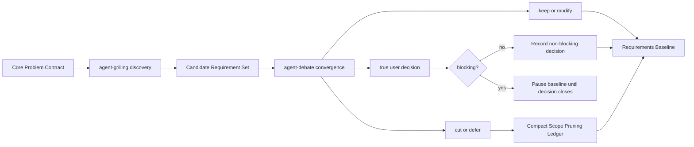

# Requirements Convergence and Baseline

Canonical contract for Candidate Requirement Set convergence, pruning, gate
evidence, blockers, and Requirements Baseline qualification.

## Terms

| Concept | Governed term | Meaning |
| --- | --- | --- |
| What actually needs solving | `Core Problem` / `Core Need` | Actor, causal problem, evidence, desired outcome, and boundary |
| Remove branches that do not earn their scope | `Requirement Convergence` / `Scope Pruning` | Adversarially keep, modify, cut, defer, or leave candidates for user decision |
| Surviving behavior | `Core Version` | Behavior subset inside the governed Requirements Baseline: implementation-eligible confirmed `keep/modify` |
| Governed artifact | `Requirements Baseline` | Core Version plus evidence, decisions, pruning memory, visuals, and trace ready for Spec |

## Lifecycle



Discovery expands; convergence prunes.

## Core Problem Contract

```text
affected actor or customer:
observed problem or unmet need:
cause and evidence:
desired user/business outcome:
must-preserve constraints:
explicit non-goal:
success signal:
source and requirement state:
```

State the problem, not a preferred solution. Split independently evidenced Core
Problems or record an explicit scope decision.

## Candidate Requirement Set

The Requirements owner assembles and versions every material feature, rule,
exception, or recovery path from consumed discovery deltas, or from governed
input plus canonical discovery-skip evidence:

```text
candidate handle:
tree path:
feature or rule considered:
contribution to the Core Problem:
source and state:
affected actor / flow:
value or success signal:
cost, complexity, risk, and dependency:
evidence gap or true decision:
```

Only the Requirements owner publishes the complete set; workers return deltas
and snapshots. Formulate candidates only deeply enough to judge.

## Adversarial Convergence

Give every participant the same Core Problem, candidates, tree handles, evidence,
constraints, and decisions. Every participant evaluates every material candidate.

Challenge each candidate on:

```text
core alignment | necessity now | evidence | user value | simpler substitute
complexity and maintenance | failure/security/privacy risk | dependencies
compatibility | release timing | effect on other surviving branches
```

Evidence outranks votes. Agents cannot cut/materially change a confirmed user
requirement or authoritative constraint; return the conflict as `user-decision`.
Rebut blocker/major disagreement; stop after every candidate has one outcome and
no agent-answerable major remains.

## Outcome Semantics

Assign exactly one outcome to every material candidate:

| Outcome | Meaning | Final location |
| --- | --- | --- |
| `keep` | Candidate earns its scope unchanged | Requirements Baseline |
| `modify` | A smaller/safer formulation earns its scope | Modified baseline requirement plus pruning row |
| `cut` | Not needed for the Core Problem or does not earn current cost/risk | Scope Pruning Ledger and Convergence Map; never Core Version |
| `defer` | Potentially useful later, but explicitly non-blocking/future/out-of-scope | Pruning ledger with owner/reopen trigger, plus Convergence Map |
| `user-decision` | Authority, taste, priority, cost/privacy, or business direction must choose | Decision ledger and Convergence Map; pause if blocking |

Do not use `defer` as a softer spelling of unresolved. Source- or
agent-answerable questions remain open work, and blocking user decisions prevent
the Requirements Baseline.

When an answered decision closes, replace `user-decision` with `keep`, `modify`,
`cut`, or `defer`; retain the decision trace. If the answer materially changes
the candidate or another branch, run targeted discovery/convergence before
passing the gate.

## Visual / Markdown Two-Layer Contract

| Layer | Owns |
| --- | --- |
| Mermaid Requirement Search Tree | What was analyzed, how branches split, and which frontier/state remains |
| Mermaid Requirements Convergence Map | Which candidates were kept, modified, cut, deferred, or left for user decision; only keep/modify form the Core Version |
| Mermaid Feature Flow Packets | How surviving functions behave at product level |
| Markdown | Core Problem evidence, detailed requirement rules, constraints, reasons, sources, pruning memory, decisions, and reopen triggers |

Use identical candidate handles across Mermaid and Markdown. Keep every
`modify/cut/defer/user-decision` visible; group routine `keep` when needed. Split
large maps. Cut/deferred nodes never enter Baseline behavior views.

## Scope Pruning Ledger

Include every `cut`, `defer`, material `modify`, and only non-obvious `keep`.

```text
| Candidate | Considered branch | Outcome | Why / evidence | Retained memory |
```

`Retained memory`: protecting non-goal/constraint, surviving implication,
deferral owner + observable reopen trigger, or `none`. No transcripts or replay.

Markdown coverage rule: every candidate handle appears exactly once as a kept baseline
requirement, a modified baseline requirement plus pruning row, a cut/deferred
pruning row, or a user-decision. This proves convergence without duplicating
detailed requirement memory. The Mermaid Convergence Map may repeat the handle
only as the brief visual layer.

## Gate Evidence and Evidence Closure

Gate Evidence separates execution, owner consumption, and governed result:

```text
gate: discovery | convergence
snapshot handle:
producer / source:
execution_status: not_started | running | completed | interrupted | failed | unavailable | skipped
consumption_status: pending | consumed | not_applicable
gate_result: pending | passed | blocked
same-scope target:
input or candidate-set version:
material deltas or candidate coverage:
skip or blocker evidence:
```

Valid pass: `completed / consumed / passed`; valid skip:
`skipped / not_applicable / passed`. Unconsumed completion is
`completed / pending / pending`; consumed unresolved debate is
`completed / consumed / blocked`. Dispatch/running/interrupted is not passed.
Debate evidence names the owner-assembled Candidate Set version derived from the
consumed discovery snapshot or canonical discovery-skip evidence.

Record phase state and blockers separately:

| Condition | Lifecycle state | Blocking reason |
| --- | --- | --- |
| Discovery is still running or answerable work remains | `discovery_pending` | none |
| Candidate Set assembly or convergence not_started/running/awaiting consumption | `convergence_pending` | none |
| Consumed convergence still has an agent-answerable blocker/major | `blocked` | `convergence_major` |
| A blocking true user decision remains | `blocked` | `user_decision` |
| Required source, access, worker capacity, or external capability is unavailable | `blocked` | `dependency` |

Blocking reasons are a set, so an artifact blocked by both a user decision and
missing source evidence records both. When no blocker remains and all readiness
conditions pass, use `baseline_ready`.

Candidate views show available state; never invent outcomes or a Core Version.

```text
| Claim / node | Evidence or user invariant | Status | Frontier if unresolved |
```

`current/existing/reuse/unchanged/authoritative`, vendor capability, and runtime
behavior require inspected evidence, explicit user invariant, or `frontier`.

Every unresolved row must name one stable frontier handle, and that same handle
must appear as `frontier:open` in the Mermaid Requirement Search Tree and in the
frontier ledger. A prose `open`, draft candidate, or grouped parent branch does
not close this trace.

## Requirements Baseline

Call an artifact `Requirements Baseline` only when:

- the Core Problem Contract is evidence-backed and stable enough for the phase
- discovery covered the affected dimensions and its Gate Evidence passed
- the Convergence Gate has `gate_result: passed` through normal
  `completed / consumed` evidence or the eligible trivial-change skip
- every material candidate has an outcome
- cut branches are absent from the Core Version, Baseline behavior tree, flow
  inventory, and Feature Flow Packets
- modified branches and retained implications are reconciled everywhere
- Core Version behavior, the Baseline tree, flow inventory, and Feature Flow
  Packets contain only implementation-eligible confirmed requirements
- blocking user decisions and high-impact source/agent frontiers are closed
- the existing visual, evidence-consistency, and Spec-readiness gates pass

Before that point call it `Requirements Candidate`, record its lifecycle state,
and retain all applicable blocking reasons.

Core Version = smallest implementation-eligible confirmed `keep/modify` set.
Draft/open and governance items stay in ledgers, never product flows. Persist a
Baseline ID when another owner needs stable traceability. Name consumed snapshots
and candidate coverage; omit candidate replay and participant arguments.
