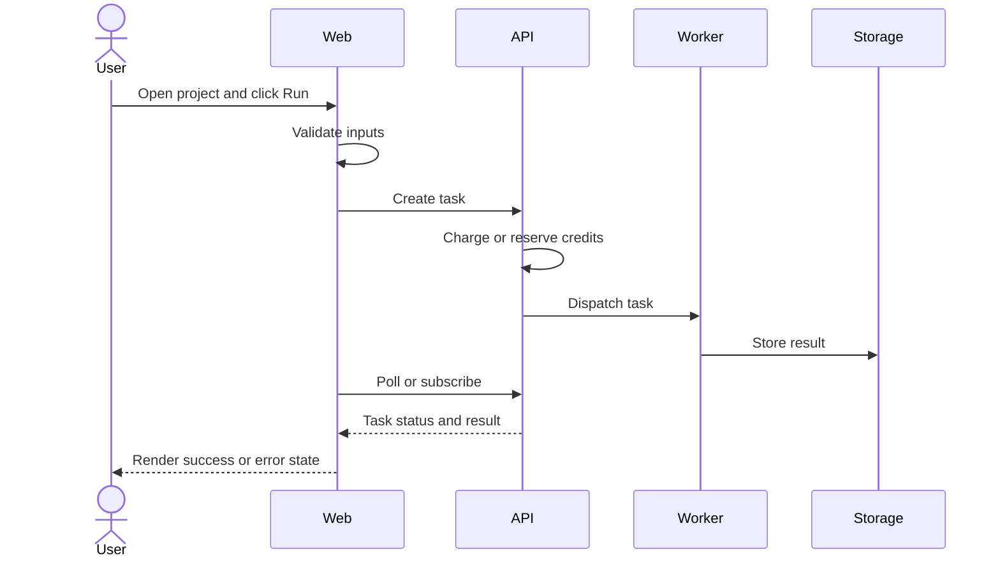
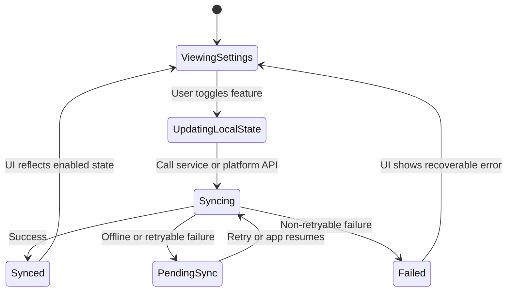

# Document Patterns

Use this reference when creating or materially changing a doc-driven documentation set.

## Contents

- Default Document Set
- Root Index
- Human-Agent Workflow
- System Map
- Data And State Flows
- Operation Flows
- Examples
- Contracts And Interfaces
- Call Paths
- Mermaid Diagrams
- Open-Question Ledger
- Final Summary

## Default Document Set

The default document set is optional and shape-aware:

```text
<doc_root>/
  README.md
  system-map.md
  operation-flows.md
  data-and-state-flows.md
  contracts-and-interfaces.md
  call-paths.md
  open-questions.md
```

Instantiate only documents justified by the observed project:

- Create `operation-flows.md` only when there are human, operator, CLI, SDK, automation, or consumer flows.
- Create `data-and-state-flows.md` only when there are meaningful persistence, lifecycle, cache, queue, file, message, migration, or recovery concerns.
- Create `contracts-and-interfaces.md` only when there are cross-boundary contracts.
- Create `call-paths.md` only when future humans or agents need source entry chains.
- Merge small projects into `README.md` when separate files would be ceremony.

Do not force Web/backend/admin-shaped docs onto other repo shapes.

## Root Index

The root index should include:

- purpose of the doc-driven docs
- resolved `doc_root` and `ledger_path`
- maintenance rule
- document map
- short source-backed system summary
- useful Mermaid overview diagram when the project structure benefits from one
- links to module docs

## Human-Agent Workflow

Doc-driven docs are an operating and implementation index for humans and agents.

The intended loop:

1. A human reads docs to understand a module, operation, contract, or call path.
2. The human notices missing, stale, surprising, or incorrect behavior.
3. The agent checks source, runtime evidence, or project guidance.
4. The agent chooses one outcome:
   - update confirmed docs when code is right and docs drifted
   - update code when docs describe the intended behavior and code drifted
   - update both when the source-backed contract changed
   - record uncertainty in the ledger when evidence is insufficient
5. Confirmed docs and implementation converge again.

Write docs so this loop is possible. A reader should be able to find where an operation starts, what happens, which files/functions matter, what state changes, and which contract or question to inspect next.

Bootstrap docs should include source-backed Mermaid diagrams when the project has meaningful structure, flows, state, contracts, or call paths that are easier to navigate visually. Maintenance must update affected diagrams when source-backed behavior, boundaries, state, or call paths change.

## System Map

Create or maintain a system map only when it helps readers understand boundaries. It can describe participants, modules, packages, processes, deployment units, devices, external systems, or storage boundaries.

Keep it source-backed. Do not turn it into a speculative architecture diagram.

## Data And State Flows

Create or maintain data/state docs only when the project has meaningful persistence, lifecycle, cache, queue, file, message, migration, or recovery behavior.

State what changes, where it lives, who owns it, what transitions are allowed, and what happens on failure or recovery.

## Operation Flows

Operation flows are written from the actor's point of view. Actors can be users, administrators, operators, CLI users, SDK consumers, internal staff, automation systems, or service callers.

Document a flow when it is user-visible, operationally critical, contract-bearing, failure-prone, risk-sensitive, or already documented.

When meaningful human, operator, consumer, automation, CLI, SDK, or service-caller interaction exists, present it in an actor-oriented flow document or section. Do not bury actor actions only inside system, data, or state-flow docs.

For each relevant flow, capture:

- entry point
- action: click, type, select, drag, upload, call, confirm, schedule, or run
- observed feedback or state transition
- success result
- failure result when source-backed
- source files and functions/components

Examples of observed feedback:

- GUI: loading, disabled, empty, warning, success, error
- CLI: exit code, stdout, stderr, progress output
- SDK/API: response shape, error code, thrown error
- automation: event, log, retry, alert

## Examples

Examples are reference shapes, not required templates. Adapt them to the real project rather than forcing these labels or files.

### Web Project

For a web product, a useful flow might show:

```text
User opens /projects
-> selects a project card
-> edits a canvas node
-> clicks Run
-> frontend validates inputs and sends request
-> backend creates task and charges or reserves credits
-> worker processes task and stores result
-> frontend polls or subscribes and renders success/error state
```

Mermaid reference:



Source-backed docs should let a human answer:

- Which page/component owns the button, form, loading state, and error copy?
- Which request fields are sent, and which backend route receives them?
- Which database rows, files, queues, or external services change?
- Which worker or background path produces the visible result?
- Where should an agent patch docs or code if the UI and backend disagree?

### App Project

For a mobile or desktop app, a useful flow might show:

```text
User opens Settings
-> toggles a permission or feature
-> app updates local state
-> app calls a service, sync engine, or platform API
-> local persistence updates
-> UI reflects success, pending sync, or recoverable failure
```

Mermaid reference:



Source-backed docs should let a human answer:

- Which screen, view model, command, or intent owns the action?
- Which platform permission, local store, background task, or sync boundary is involved?
- What happens offline, after restart, or when the platform API fails?
- Which observable UI state proves success or failure?
- What source path should an agent inspect when docs and behavior diverge?

## Contracts And Interfaces

Document contracts that other code, systems, or humans rely on:

- API routes
- public functions/classes
- events/messages
- CLI flags
- file formats
- config formats
- schemas
- external protocols
- permission or trust rules

Avoid listing private implementation details unless they are needed for future maintenance.

## Call Paths

Call paths should be compact and source-backed:

```text
entry file or actor
-> source file:function/component
-> source file:function/service
-> source file:repository/adapter/side effect
```

Keep paths useful for navigation, not exhaustive stack traces.

## Mermaid Diagrams

Mermaid diagrams are expected for non-trivial doc-driven documentation sets when they improve human navigation.

Bootstrap should create at least one source-backed Mermaid diagram in the root index or a relevant module doc when the project has enough structure for a useful diagram. Material docs for operation flows, state/data flows, contracts, or call paths should include a Mermaid diagram when the relationship is easier to understand visually.

Maintenance must update existing diagrams when the documented behavior, system boundary, state lifecycle, call path, or interaction flow changes. For tiny projects or narrow ledgers, omit diagrams when they would be decorative, speculative, or less useful than a compact source-backed text summary.

Good diagram types:

- system map
- sequence flow
- state lifecycle
- data flow
- operation journey

Do not add decorative diagrams. Mermaid diagrams must be traceable to source evidence and useful for human navigation.

## Open-Question Ledger

Unconfirmed questions, suspected issues, stale docs, or product decisions go to `ledger_path`, not confirmed docs.

Levels:

- `confirmed issue`: explicit contract, test, schema, invariant, or unambiguous code path proves wrong behavior
- `likely issue`: strong suspicion that needs runtime, environment, or product validation
- `question`: evidence is insufficient; needs clarification
- `stale doc`: existing docs contradict current source, config, or observed behavior
- `product decision needed`: technical behavior is possible but product, operations, trust, or experience needs a decision

Statuses:

- `open`
- `needs verification`
- `deferred`
- `resolved`
- `superseded`

Entry format:

```markdown
### <short title>

- Level: `<level>`
- Status: `<status>`
- Observed: <source-backed observation>
- Risk: <why it matters>
- Evidence: `<path>` or `<path:function>`
- Suggested next step: <one concrete next step>
```

Write rules:

- Update an existing matching entry instead of duplicating it.
- If multiple ledgers exist, use the ledger resolved by `modes-and-gates.md`.
- Prefer lower certainty when evidence is incomplete.
- After a fix, update status and evidence instead of deleting the entry unless the project docs define cleanup rules.

## Final Summary

Keep final output short and traceable:

```text
Docs updated:
- path: reason

Ledger entries recorded:
- level path-or-title: short reason

Skipped:
- reason
```

If nothing changed:

```text
Doc-driven maintenance skipped: no existing documented behavior changed.
```
